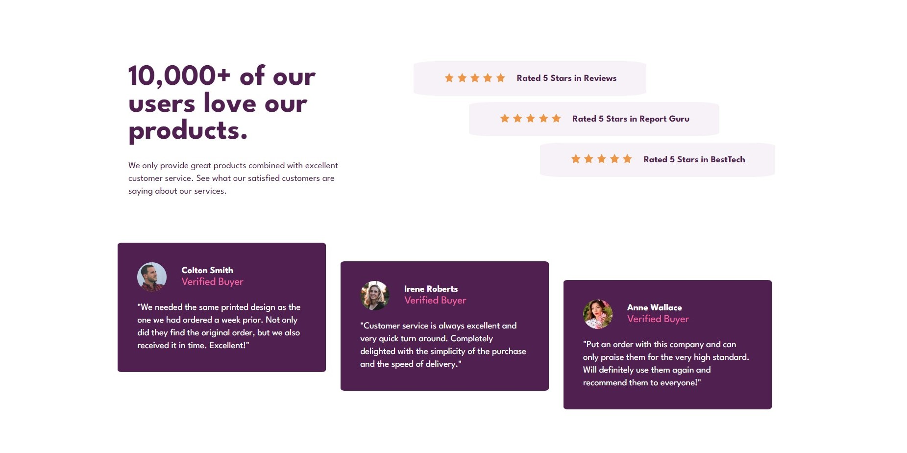

# Frontend Mentor - Social proof section solution

This is a solution to the [Social proof section challenge on Frontend Mentor](https://www.frontendmentor.io/challenges/social-proof-section-6e0qTv_bA). Frontend Mentor challenges help you improve your coding skills by building realistic projects. 

## Table of contents

- [Frontend Mentor - Social proof section solution](#frontend-mentor---social-proof-section-solution)
  - [Table of contents](#table-of-contents)
  - [Overview](#overview)
    - [The challenge](#the-challenge)
    - [Screenshot](#screenshot)
    - [Links](#links)
  - [My process](#my-process)
    - [Built with](#built-with)
    - [What I learned](#what-i-learned)
  - [Acknowledgments](#acknowledgments)

**Note: Delete this note and update the table of contents based on what sections you keep.**

## Overview

### The challenge

Users should be able to:

- View the optimal layout for the section depending on their device's screen size

### Screenshot

### Links

- Solution URL: [FE Mentor solution](https://www.frontendmentor.io/solutions/flexbox-mobile-first-9_2stx6507)
- Live Site URL: [Netlify](https://vocal-faloodeh-c3dba7.netlify.app)

## My process
At first we started desktop first and it was frustrating. Just the top right part took us a couple of hours.

We next tried it after having learned some useful things in the Bootcamp. We started from scrath and this time around we used the Mobile first workflow. Everything went smoothly this time. Mobile version took little time and then it was time to adapt it to desktop. 

It took us some time to get everything as close as in the design of the challenge but I´m very proud of the result.

### Built with

- Semantic HTML5 markup
- CSS custom properties
- Flexbox
- CSS Grid
- Mobile-first workflow

### What I learned

- Using Flexbox properly
- Getting used to Mobile First workflow
- Using the @media properly
  
## Acknowledgments

Most of the project was done in collaboration with Abdullah. It was a pleasure working with him.

Special thanks to Juli and Nair, whose tips made the fine-tuning much easier.
